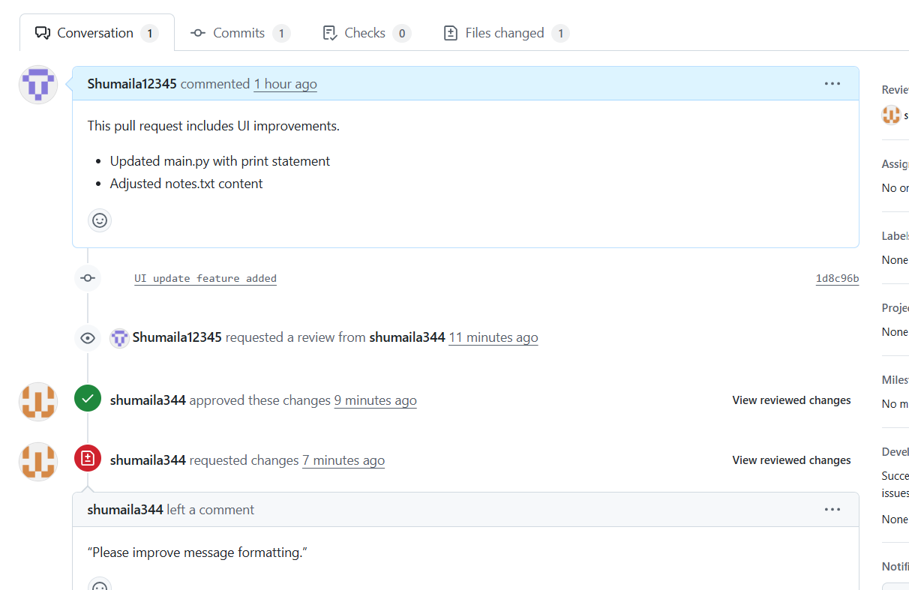

# Lab 2 - Computer Communication

**Name:** Shumaila Munsib  
**Roll No:** 2023-BSE-062  
**Submitted to:** Sir Shoaib  

---

## 🧠 Lab Overview
This lab demonstrates Git and GitHub operations including initialization, commits, branching, pull requests, merges, and collaboration.  
*(Screenshots only — as per instructor’s instructions.)*

---

## 🖼️ Screenshots

### 1. Git Initialization

---

### 2. First Commit

---

### 3. Git Push

---

### 4. Branching

---

### 5. Pull Requests (PR)

---

### 6. Collaboration

---

### 7. Final Merge

---

## ✅ Note
- Place **all screenshots** inside `lab2/images/` in your repository.  
- This `README.md` belongs inside the `lab2/` folder and references images with relative paths (`images/...`).  
- No theory or text explanation is included — **only screenshots** as instructed.
